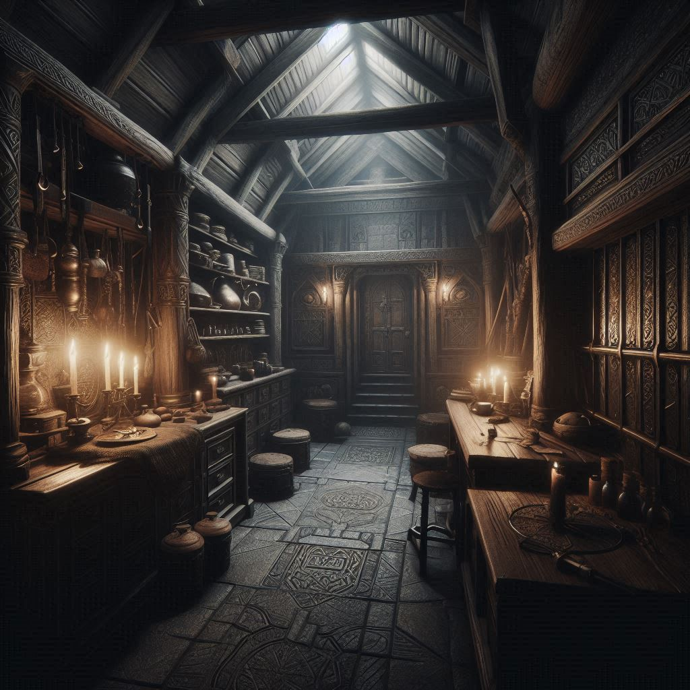

# game-point-and-click-adventure
Exploring the possibilities of AI generated images and text in simple point-and-click adventure web game

(click on the image to play online)

### My other games

- [Alien invasion](https://github.com/dvhx/game-alien-invasion) - 2D bullet hell alien shooter, collect credits and upgrade your ship
- [Word puzzle](https://github.com/dvhx/game-word-puzzle) - crossword-like puzzle
- [Virtual boyfriend](https://github.com/dvhx/game-virtual-boyfriend) - talk with cute virtual boyfriend, buy clothes, visit locations, play mini games
- [Robot puzzle](https://github.com/dvhx/game-robot-puzzle) - control robot using simple instructionsto solve logical puzzles
- [Ghost town](https://github.com/dvhx/game-ghost-town) - 2D top-view pixel art web game where you walk and talk with various NPCs and solve quests
- [Ghost town 2](https://github.com/dvhx/game-ghost-town-2) - fight monsters and solve quests, non-talking sequel to ghost town game
- [Balloon mountains](https://github.com/dvhx/game-balloon-mountains) - Pop balloons while flying over misty mountains
- [Ghost chat bot](https://github.com/dvhx/game-ghost-chatbot) - chat with very simple chatbot, no LLM!
- [Beach volleyball](https://github.com/dvhx/game-beach-volleyball) - play beach volleyball against opponent using swipe up gesture (or mouse) 
- [Hide and seek](https://github.com/dvhx/game-hide-and-seek) - 2D top-view pixel art hide and seek game with a flashlight effect
- [Ghost car challenge](https://github.com/dvhx/game-ghost-car-challenge) - WebGL 3D game where you compete against "ghost drivers", uses tilt sensor on mobile phones (Android)
- [Trash everything](https://github.com/dvhx/game-trash-everything) - Destroy furniture in 2D pixel art levels

### Support

You can support development on [Patreon](https://www.patreon.com/DusanHalicky) or you can hire me via [Upwork](https://www.upwork.com/freelancers/~013b4c3d6e772fdb01)

